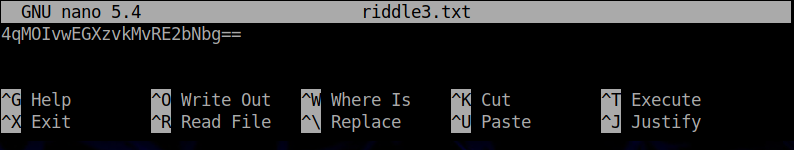

# Cryptography Homework: Ransomware Riddles

## Riddle 1:

        gruber

        6skd8s

## Riddle 2:

        Gennero

        cy8snd2

## Riddle 3:

        nano riddle3.txt

        openssl enc -pbkdf2 -nosalt -aes-256-cbc -d -in riddle3.txt -base64 -K 5284A3B154D99487D9D8D8508461A478C7BEB67081A64AD9A15147906E8E8564 -iv 1907C5E255F7FC9A6B47B0E789847AED

        takagi

        ud6s98n

## Riddle 4:

        7gsn3nd2

## Riddle 5:

        argyle

        ajy39d2

## Riddle 6:

        mcclane

        7skahd6

## Conclusion:

