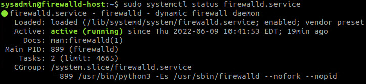
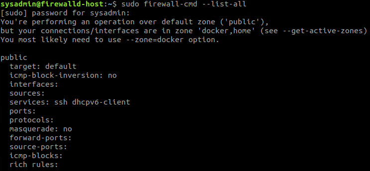
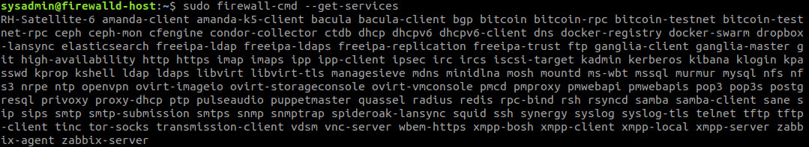
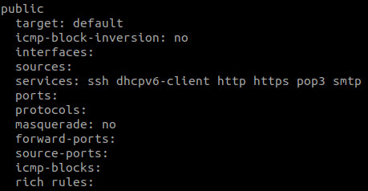
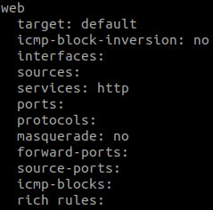
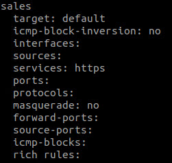
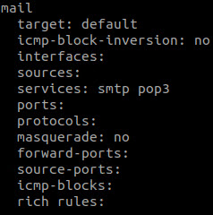
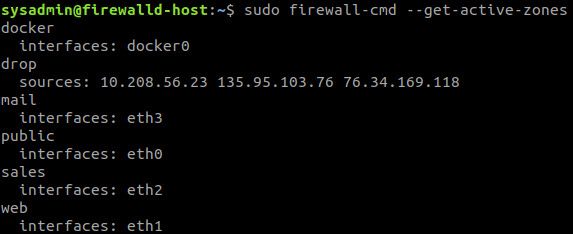

## Unit 11 Submission File: Network Security Homework 

### Part 1: Review Questions 

#### Security Control Types

The concept of defense in depth can be broken down into three different security control types. Identify the security control type of each set  of defense tactics.

1. Walls, bollards, fences, guard dogs, cameras, and lighting are what type of security control?

        Physical Security

2. Security awareness programs, BYOD policies, and ethical hiring practices are what type of security control?

        Administrative Security

3. Encryption, biometric fingerprint readers, firewalls, endpoint security, and intrusion detection systems are what type of security control?

        Operational Security

#### Intrusion Detection and Attack indicators

1. What's the difference between an IDS and an IPS?

        An IDS only issues alerts for potential attacks.
        An IPS works to actively prevent and take actions against potential attacks.

2. What's the difference between an Indicator of Attack and an Indicator of Compromise?

        An IOA spots potential attacks and tries to understand the intent.
        An IOC looks in to finding evidence that a system has been breached.

#### The Cyber Kill Chain

Name each of the seven stages for the Cyber Kill chain and provide a brief example of each.

1. Stage 1:

        Reconnaissance - Digging up information on a potential target

2. Stage 2:

        Weaponisation - Creating/Procuring malware or making a backdoor method

3. Stage 3:

        Delivery - Sending the weapon to the target via email

4. Stage 4:

        Exploit - Gaining access to the target after the malware has been opened by the target

5. Stage 5:

        Installation - Integrating more malicious files on the target's system via the exploit

6. Stage 6:

        Command and Control - Using a direct route to continuously control the target

7. Stage 7:

        Actions - Fulfilling the original goal of the attacker


#### Snort Rule Analysis

Use the Snort rule to answer the following questions:

Snort Rule #1

```bash
alert tcp $EXTERNAL_NET any -> $HOME_NET 5800:5820 (msg:"ET SCAN Potential VNC Scan 5800-5820"; flags:S,12; threshold: type both, track by_src, count 5, seconds 60; reference:url,doc.emergingthreats.net/2002910; classtype:attempted-recon; sid:2002910; rev:5; metadata:created_at 2010_07_30, updated_at 2010_07_30;)
```

1. Break down the Sort Rule header and explain what is happening.

        The external network port range of 5800 to 5820 will alert on any inbound TCP traffic.

2. What stage of the Cyber Kill Chain does this alert violate?

        Reconnaissance

3. What kind of attack is indicated?

        Port mapping via a VNC Scan on ports 5800 to 5820.

Snort Rule #2

```bash
alert tcp $EXTERNAL_NET $HTTP_PORTS -> $HOME_NET any (msg:"ET POLICY PE EXE or DLL Windows file download HTTP"; flow:established,to_client; flowbits:isnotset,ET.http.binary; flowbits:isnotset,ET.INFO.WindowsUpdate; file_data; content:"MZ"; within:2; byte_jump:4,58,relative,little; content:"PE|00 00|"; distance:-64; within:4; flowbits:set,ET.http.binary; metadata: former_category POLICY; reference:url,doc.emergingthreats.net/bin/view/Main/2018959; classtype:policy-violation; sid:2018959; rev:4; metadata:created_at 2014_08_19, updated_at 2017_02_01;)
```

1. Break down the Sort Rule header and explain what is happening.

        The remote host tried to deliver a payload through HTTP port 80.

2. What stage of the Cyber Kill Chain does this alert violate?

        Delivery

3. What kind of attack is indicated?

        Cross Site Scripting

Snort Rule #3

- Your turn! Write a Snort rule that alerts when traffic is detected inbound on port 4444 to the local network on any port. Be sure to include the `msg` in the Rule Option.

        alert tcp $EXTERNAL_NET any -> $HOME_NET 4444 (msg:"ET POSSIBLE TOJAN or CRACKDOWN")

### Part 2: "Drop Zone" Lab

#### Uninstall `ufw`

Before getting started, you should verify that you do not have any instances of `ufw` running. This will avoid conflicts with your `firewalld` service. This also ensures that `firewalld` will be your default firewall.

- Run the command that removes any running instance of `ufw`.

        sudo apt remove ufw

#### Enable and start `firewalld`

By default, these service should be running. If not, then run the following commands:

- Run the commands that enable and start `firewalld` upon boots and reboots.

        sudo systemctl enable firewalld.service
        sudo /etc/init.d/firewalld start

#### Confirm that the service is running.

- Run the command that checks whether or not the `firewalld` service is up and running.

        sudo systemctl status firewalld.service



#### List all firewall rules currently configured.

Next, lists all currently configured firewall rules. This will give you a good idea of what's currently configured and save you time in the long run by not doing double work.

- Run the command that lists all currently configured firewall rules:

        sudo firewall-cmd --list-all



#### List all supported service types that can be enabled.

- Run the command that lists all currently supported services to see if the service you need is available

        sudo firewall-cmd --get-services



#### Zone Views

- Run the command that lists all currently configured zones.

        sudo firewall-cmd --list-all-zones

#### Create Zones for `Web`, `Sales` and `Mail`.

- Run the commands that creates Web, Sales and Mail zones.

        sudo firewall-cmd --permanent --new-zone=web
        sudo firewall-cmd --permanent --new-zone=sales
        sudo firewall-cmd --permanent --new-zone=mail

#### Set the zones to their designated interfaces:

- Run the commands that sets your `eth` interfaces to your zones.

        sudo firewall-cmd --zone=public --change-interface=eth0
        sudo firewall-cmd --zone=web --change-interface=eth1
        sudo firewall-cmd --zone=sales --change-interface=eth2
        sudo firewall-cmd --zone=mail --change-interface=eth3

#### Add services to the active zones:

- Run the commands that add services to the **public** zone, the **web** zone, the **sales** zone, and the **mail** zone.

- Public:

        sudo firewall-cmd --permanent --zone=public --add-service=http
        sudo firewall-cmd --permanent --zone=public --add-service=https
        sudo firewall-cmd --permanent --zone=public --add-service=pop3
        sudo firewall-cmd --permanent --zone=public --add-service=smtp

- Web:

        sudo firewall-cmd --permanent --zone=web --add-service=http

- Sales

        sudo firewall-cmd --permanent --zone=sales --add-service=https

- Mail

        sudo firewall-cmd --permanent --zone=mail --add-service=smtp
        sudo firewall-cmd --permanent --zone=mail --add-service=pop3

- What is the status of `http`, `https`, `smtp` and `pop3`?









#### Add your adversaries to the Drop Zone.

- Run the command that will add all current and any future blacklisted IPs to the Drop Zone.

        sudo firewall-cmd --permanent --zone=drop --add-source=10.208.56.23  
        sudo firewall-cmd --permanent --zone=drop --add-source=135.95.103.76  
        sudo firewall-cmd --permanent --zone=drop --add-source=76.34.169.118  

#### Make rules permanent then reload them:

- Run the command that reloads the `firewalld` configurations and writes it to memory

        sudo firewall-cmd --reload

#### View active Zones

Now, we'll want to provide truncated listings of all currently **active** zones. This a good time to verify your zone settings.

- Run the command that displays all zone services.

        sudo firewall-cmd --get-active-zones



#### Block an IP address

- Use a rich-rule that blocks the IP address `138.138.0.3`.

        sudo firewall-cmd --zone=public --add-rich-rule='rule family="ipv4" source address="138.138.0.3" reject'

#### Block Ping/ICMP Requests

- Run the command that blocks `pings` and `icmp` requests in your `public` zone.

        sudo firewall-cmd --zone=public --add-icmp-block=echo-reply --add-icmp-block=echo-request

#### Rule Check

- Run the command that lists all  of the rule settings. Do one command at a time for each zone.

        sudo firewall-cmd --zone=public --list-all  
        sudo firewall-cmd --zone=sales --list-all
        sudo firewall-cmd --zone=mail --list-all
        sudo firewall-cmd --zone=web --list-all
        sudo firewall-cmd --permanent --zone=drop --list-all

- Are all of our rules in place? If not, then go back and make the necessary modifications before checking again.

  - Yes, all the rules are in place.

### Part 3: IDS, IPS, DiD and Firewalls

#### IDS vs. IPS Systems

1. Name and define two ways an IDS connects to a network.

   Answer 1:

- Network-based Intrusion Detection System

        It looks for patterns and abnormal behaviours at a network level. The NIDS will send a warning if it notices anything going in or out.

   Answer 2:

- Host-based Intrusion Detection System

        It looks for patterns and abnormal behaviours on a single host. The HIDS has the ability to take snapshots and analise them for malicious changes.

2. Describe how an IPS connects to a network.

   Answer:

        An IPS will connect from directly behind the firewall on a switch's mirroed port.

3. What type of IDS compares patterns of traffic to predefined signatures and is unable to detect Zero-Day attacks?

   Answer:

        Signature-based

4. Which type of IDS is beneficial for detecting all suspicious traffic that deviates from the well-known baseline and is excellent at detecting when an attacker probes or sweeps a network?

   Answer:

        Anomaly-based

#### Defense in Depth

- For each of the following scenarios, provide the layer of Defense in Depth that applies:

    1.  A criminal hacker tailgates an employee through an exterior door into a secured facility, explaining that they forgot their badge at home.

        Answer:

                Administrative Policy (Physical)     

    2. A zero-day goes undetected by antivirus software.

        Answer:

                Technical Software (Application)

    3. A criminal successfully gains access to HR’s database.

        Answer:

                Technical Network (Data)

    4. A criminal hacker exploits a vulnerability within an operating system.

        Answer:

                Technical Software (Host)

    5. A hacktivist organization successfully performs a DDoS attack, taking down a government website.

        Answer:
                Technical Network

    6. Data is classified at the wrong classification level.

        Answer:

                Administrative Procedures (Policy, procedures, and awareness)

    7. A state sponsored hacker group successfully firewalked an organization to produce a list of active services on an email server.

        Answer:

                Administrative Network (Permimeter)

- Name one method of protecting data-at-rest from being readable on hard drive.

    Answer:

        Drive Encryption

- Name one method to protect data-in-transit.

    Answer:

        Data Encryption

- What technology could provide law enforcement with the ability to track and recover a stolen laptop.

   Answer:

        Tracking Software or Network Card

- How could you prevent an attacker from booting a stolen laptop using an external hard drive?

    Answer:

        BIOS or UEFI Password Policy (Firmware Encryption)


#### Firewall Architectures and Methodologies

1. Which type of firewall verifies the three-way TCP handshake? TCP handshake checks are designed to ensure that session packets are from legitimate sources.

  Answer:

        Circuit-level Gateways

2. Which type of firewall considers the connection as a whole? Meaning, instead of looking at only individual packets, these firewalls look at whole streams of packets at one time.

  Answer:

        Stateful Inspection Firewalls

3. Which type of firewall intercepts all traffic prior to being forwarded to its final destination. In a sense, these firewalls act on behalf of the recipient by ensuring the traffic is safe prior to forwarding it?

  Answer:

        Proxy Firewalls

4. Which type of firewall examines data within a packet as it progresses through a network interface by examining source and destination IP address, port number, and packet type- all without opening the packet to inspect its contents?

  Answer:

        Packet-filtering Firewalls

5. Which type of firewall filters based solely on source and destination MAC address?

  Answer:

        Next-Generation Firewalls