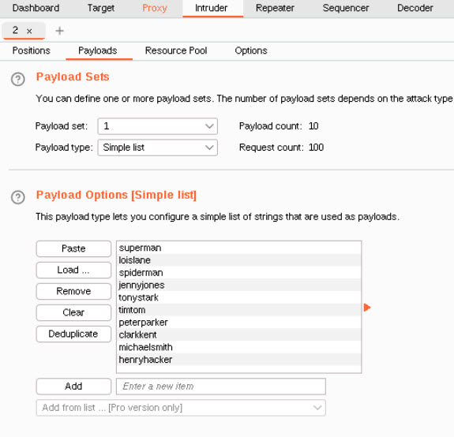
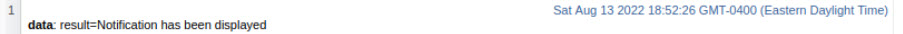
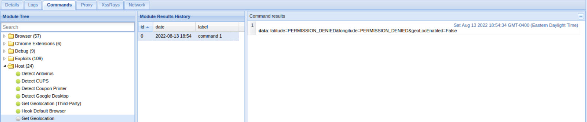

# Unit 15 Homework - Web Vulnerabilities and Hardening.

### Web Application 1: *Your Wish is My Command Injection*

- There are five levels of sub-directories:

    

- `/etc/passwd`

    

- `/etc/hosts`

    

### ***Recommended Mitigation Strategies***  
-------------------------------------------
  > - **Try to avoid command line calls** - _API's should be used where ever possible._  
  > - **Input Validation** - _A white list of possible inputs should be created for the system to accept only pre-approved inputs_  
  > - **Run with Restricted Permissions** - _Reduce the number of users able to access the database. Access should also be restricted to secure the locations of all confidential files and directories._

  ### Web Application 2: *A Brute Force to Be Reckoned With*

- After typing in some test credentials I switched over to Burp Suite:

- `Intercept Example`

    

- `Choosing Fields After Sending Results to Intruder`

    

- `Payload Field #1`

    

- `Payload Field #2`

    

- `After Running the Attack`

    

        After trying one hundred different possible combinations, Burp Suite finally found a working set of credentials. As seen above, the following worked:
        - Login:    tonystark
        - Password: I am Iron Man

### ***Recommended Mitigation Strategies***  
-------------------------------------------
>   - Passwords should be changed more frequently.
> There several ways to monitor and mitigate:  
>   - After fixed number of attempts an account should be locked.
>   - An IP address should get locked out if multiple login attempts are happening too frequently or at the same time.  
>   - Implement some sort of brute force scanner to keep logs if certain events occur.

### Web Application 3: *Where's the BeEF?*

- In order to hook the victim, a payload had to be injected. Unfortunately there was a character limit in the form.

    - `Limit Mitigated:`
    

        maxlength="50" was changed to maxlength=`"75"`

    - `First Exploit:`
    
    

    - `Results:`

    

    - `Second Exploit:`

    

    - `Results:`

    

    - `Third Exploit:`

    

        As shown above, this final exploit did not work as intended. The Firefox browser likely has some security measures in place to prevent the dissemination of location information.

### ***Recommended Mitigation Strategies***  
-------------------------------------------
> - The internet browser and system should be kept up to date.
> - Passwords should be changed regularly to eliminate passwords that have already been compromised.
> - If a VM is being used, it should be returned to a clean state on a regular basis.
