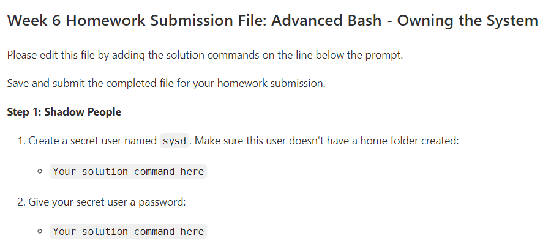

# CyberSecurity-Bootcamp

Week 6 Homework Submission File: Advanced Bash - Owning the System
Please edit this file by adding the solution commands on the line below the prompt.
Save and submit the completed file for your homework submission.
Step 1: Shadow People

Create a secret user named sysd. Make sure this user doesn't have a home folder created:

Your solution command here

        ENTERENTER

Give your secret user a password:

Your solution command here

Give your secret user a system UID < 1000:

Your solution command here

Give your secret user the same GID:

Your solution command here

Give your secret user full sudo access without the need for a password:

Your solution command here

Test that sudo access works without your password:

Your bash commands here

Step 2: Smooth Sailing

Edit the sshd_config file:

Your bash commands here

Step 3: Testing Your Configuration Update

Restart the SSH service:

Your solution command here

Exit the root account:

Your solution command here

SSH to the target machine using your sysd account and port 2222:

Your solution command here

Use sudo to switch to the root user:

Your solution command here

Step 4: Crack All the Passwords

SSH back to the system using your sysd account and port 2222:

Your solution command here

Escalate your privileges to the root user. Use John to crack the entire /etc/shadow file:

Your solution command here