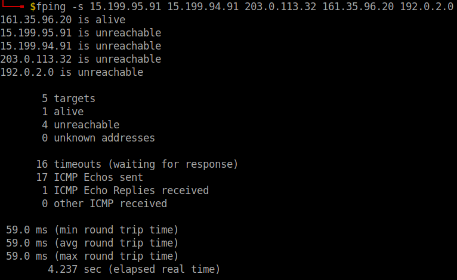
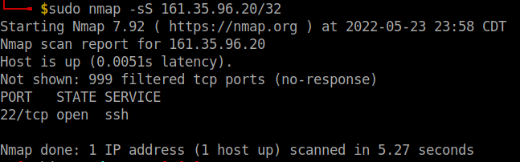
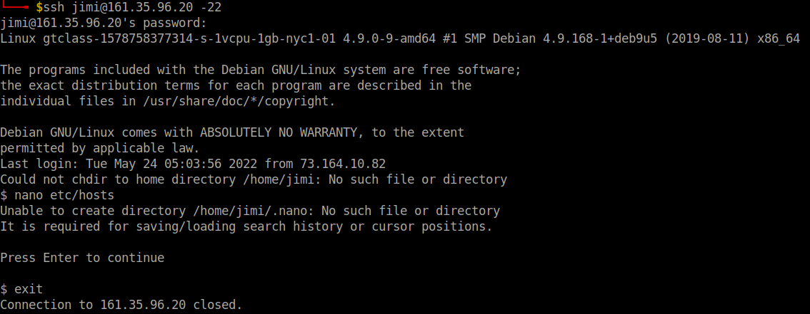
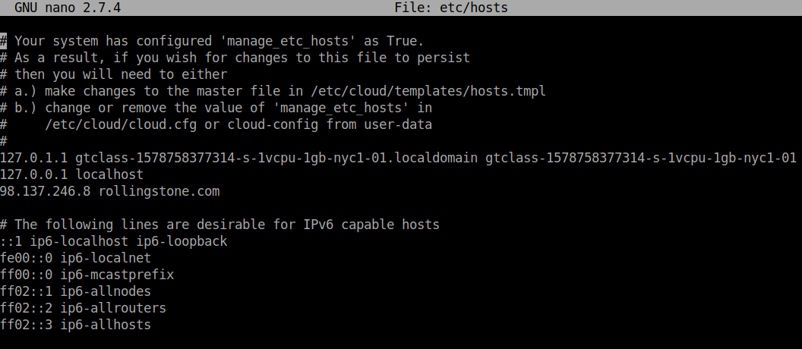
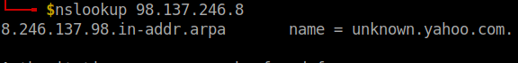
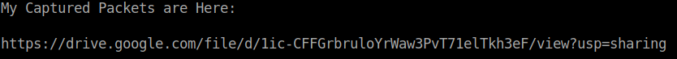
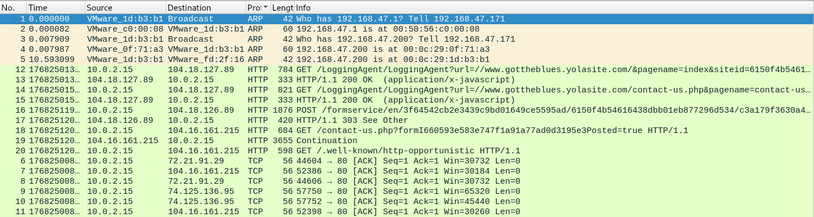
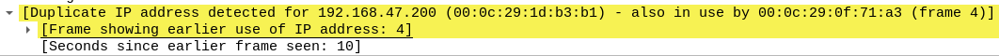
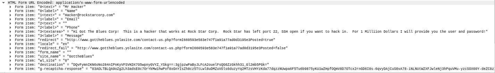

# Networking Fundamentals Homework: Rocking your Network!

## **Phase 1**: _"I'd like to Teach the World to `Ping`"_

- Hollywood Office IPs:
    - 15.199.95.91
    - 15.199.94.91
    - 203.0.113.32
    - 161.35.96.20
    - 192.0.2.0

- All the listed IP addresses are unreachable except for, "161.35.96.20"
    - This IP of, "161.35.96.20," is listed as alive. RockStar Corp would like to not respond to any requests, so this is a vulnerability.

- The server located at, "161.35.96.20," should have ICMP echo requests restricted.

- OSI Layer 3: Network

## **Phase 2**:  _"Some `Syn` for Nothin`"_

- Port 22 is open.

- OSI Layer 4:Transport
    - SYN uses TCP

## Phase 3: _"I Feel a `DNS` Change Comin' On"_

- SSH Login

- Hosts File Altered

- Using The Default Credentials:

  - **Username:**   `jimi`

  - **Password:**   `hendrix`

- I was able to ssh in to the open IP address using port 22.
- Then I examined the etc/hosts file for any alterations. I found one:

        98.137.246.8 rollingstone.com

- nslookup ran on, "98.137.246.8"

- OSI Layer 7: Application
    - DNS runs in parallel to the HTTP application

 ## Phase 4:  _"Sh`ARP` Dressed Man"_

 - Found the file left behind by the hacker:

        ssh jimi@161.35.96.20 -22
        ls etc/
        cat etc/packetcaptureinfo.txt

- It appears as if the hacker was trying to access local IP address, "192.168.47.200," with a unique MAC address:

- I see that someone was accessing the, "Contact Us," form on, "http://www.gottheblues.yolasite.com/" Not sure what that is about...

- The hacker may be trying to sell login credentials to the open port 22, for others to access.

- OSI Layer 7: Application
    - Input on a Website