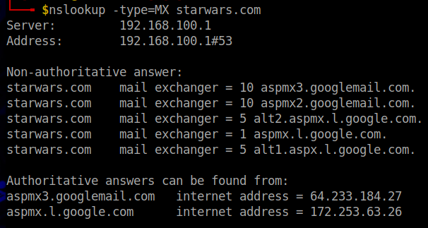
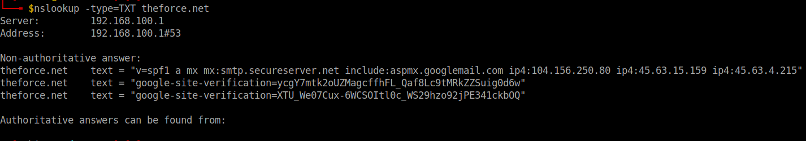
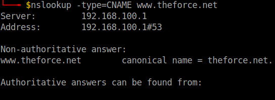
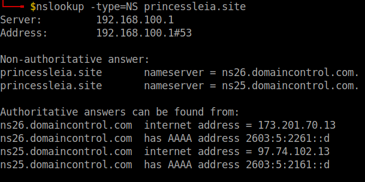
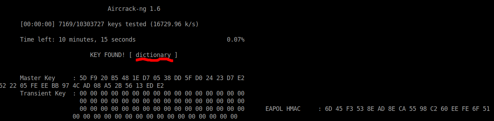
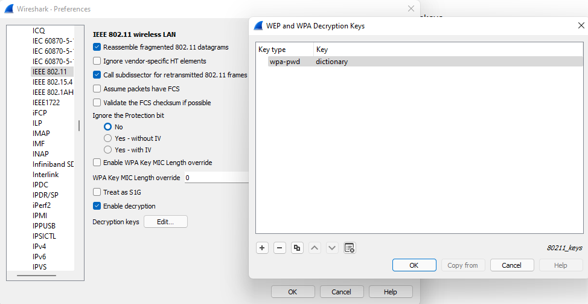
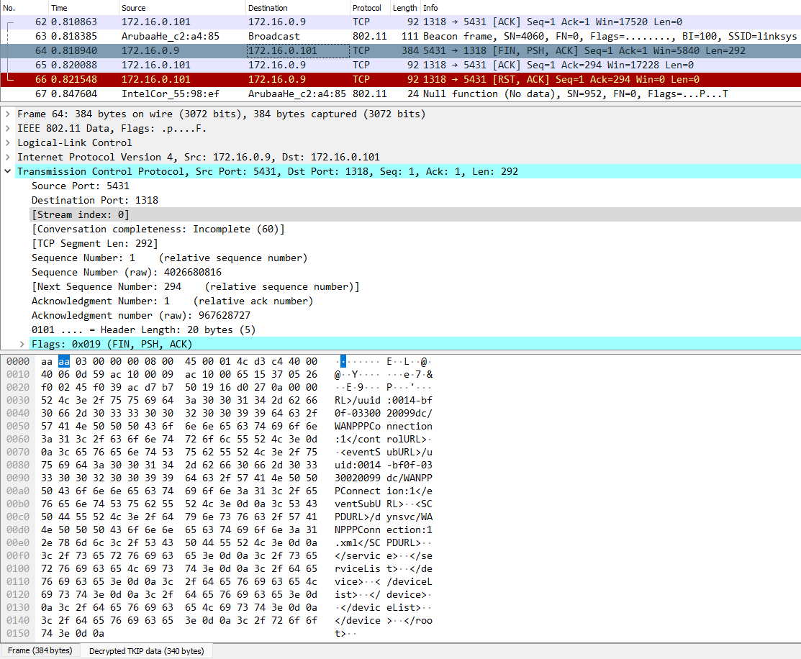

# Networks Fundamentals II Homework: *In a Network Far, Far Away!*

## Mission 1  

- Determine and document the mail servers for starwars.com using NSLOOKUP.

- Explain why the Resistance isn't receiving any emails.

    - They aren't receiving emails due to having incorrect primary and secondary mail servers showing in their MX Records.

- Document what a corrected DNS record should be.

      starwars.com    mail exchanger = 1 asltx.l.google.com
      starwars.com    mail exchanger = 5 asltx.2.google.com

## Mission 2

  - Determine and document the `SPF` for `theforce.net` using NSLOOKUP.

  

      theforce.net	text = "v=spf1 a mx mx:smtp.secureserver.net include:aspmx.googlemail.com ip4:104.156.250.80 ip4:45.63.15.159 ip4:45.63.4.215"

  - Explain why the Force's emails are going to spam.

    - The force needs to update their DNS records to reflect the changed mail server.

  - Document what a corrected DNS record should be.
    - The DNS should have the following IP address:

          45.23.176.21
  
## Mission 3
  
  - Document how a CNAME should look by viewing the CNAME of `www.theforce.net` using NSLOOKUP.

  
  - Explain why the sub page of `resistance.theforce.net` isn't redirecting to `theforce.net`.
    - The DNS records are missing a line where, "resistance.theforce.net" is pointed to, "theforce.net".
  
  - Document what a corrected DNS record should be.

        www.theforce.net          canonical name = theforce.net.
        resistance.theforce.net   canonical name = theforce.net
  
  
## Mission 4

  - Confirm the DNS records for `princessleia.site`.

  - Document how you would fix the DNS record to prevent this issue from happening again.

        princessleia.site      nameserver = ns2.galaxybackup.com.
    
  
## Mission 5

- View the [Galaxy Network Map](resources/Galaxy_Network_map.png) and determine the `OSPF` shortest path from `Batuu` to `Jedha`.

  - The shortest path is:

        Batuu---D-C-E-F-J-I-L-Q-T-V---Jedha
        0-------1-2-1-1-1-1-6-4-2-2-------2
        23 Hops Total

- Confirm your path doesn't include `Planet N` in its route.
  - This path does not include, "Planet N."

- Document this shortest path so it can be used by the Resistance to develop a static route to improve the traffic.

          Batuu---D-C-E-F-J-I-L-Q-T-V---Jedha
  
## Mission 6

- Figure out the Dark Side's secret wireless key by using Aircrack-ng.

      aircrack-ng Darkside.pcap -w /usr/share/wordlists/rockyou.txt

    KEY FOUND! [ dictionary ]

- Use the Dark Side's key to decrypt the wireless traffic in Wireshark.

- Once you have decrypted the traffic, figure out the following Dark Side information:

  - Host IP Addresses and MAC Addresses by looking at the decrypted `ARP` traffic.

        Target: 172.16.0.101 is at Cisco-Li_e3:e4:01 (00:13:ce:55:98:ef)
        Sender: 172.16.0.1 is at IntelCor_55:98:ef (00:0f:66:e3:e4:01)

  - Document these IP and MAC Addresses, as the resistance will use these IP addresses to launch a retaliatory attack.

        Target: 172.16.0.101 is at Cisco-Li_e3:e4:01 (00:13:ce:55:98:ef)
        Sender: 172.16.0.1 is at IntelCor_55:98:ef (00:0f:66:e3:e4:01)

        Destination: 172.16.0.9 is at 00:14:bf:0f:03:30
        Location: http://172.16.0.9:5431/dyndev/uuid:0014-bf0f-0330000099dc\r\n

## Mission 7 

[Starwars Video](Videos/Starwars.mp4)      
  
